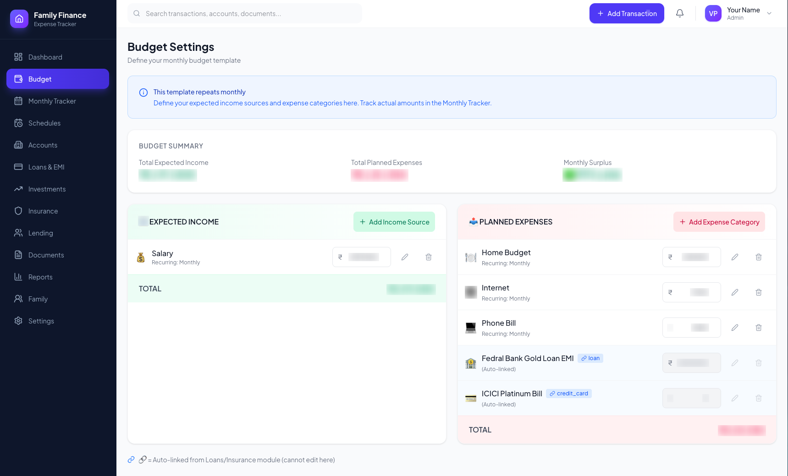
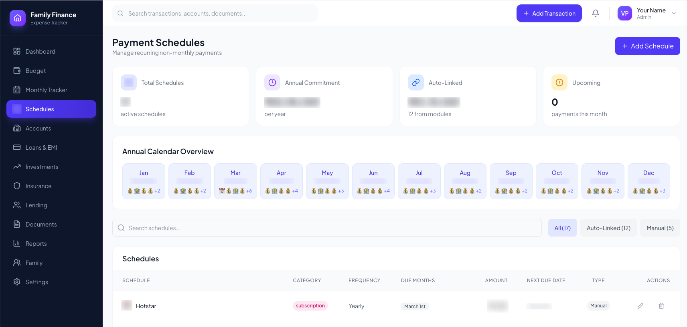
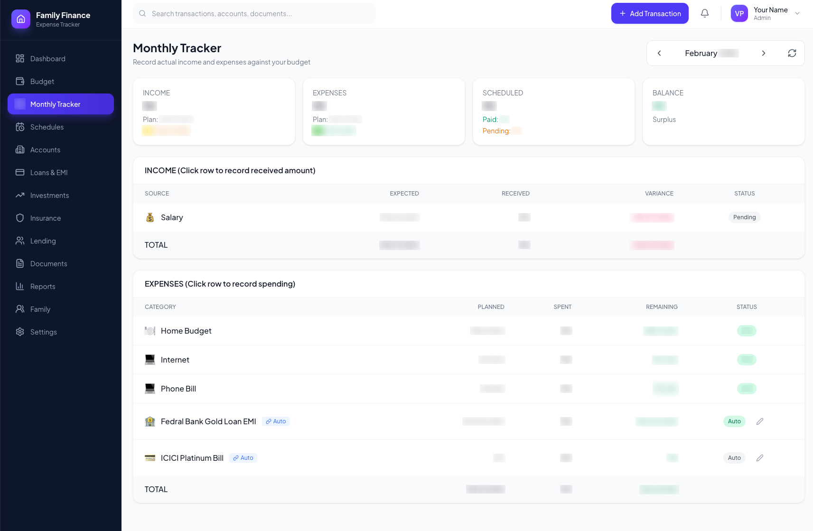
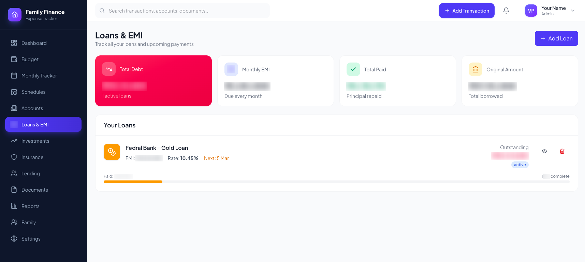

# Family Expenses Tracker

A comprehensive web application built for **Indian families** to track expenses, budgets, accounts, loans, investments, insurance, and more. Built with React, TypeScript, and Supabase.

Designed around common Indian household financial flows: **chit funds**, **gifts to relatives**, **personal lending** (udhar/len-den), **gold loans**, and other cultural financial practices.

## Features

- **Dashboard** — Overview of your financial health at a glance
- **Budget** — Plan income and expenses, track planned vs actual spending
- **Monthly Tracker** — Track expenses month by month
- **Accounts** — Manage bank accounts and credit cards (Indian banks)
- **Loans** — Track EMIs (home, car, personal, **gold loans**, education)
- **Investments** — Mutual funds, FD, RD, PPF, stocks, **chit funds**
- **Insurance** — LIC, health, term, vehicle policies
- **Lending** — **Personal lending** (given/taken), gifts to relatives
- **Documents** — Store and organize financial documents
- **Schedules** — Recurring payments (quarterly, half-yearly, yearly)
- **Reports** — Financial reports and insights
- **Family** — Family member management
- **Notifications** — EMI, card due, insurance reminders
- **Auth** — Secure login with email/password and OAuth (Supabase Auth)

## How Budget, Monthly Tracker & Schedules Work Together

These three features form the core of monthly financial planning:

### Budget — Your monthly plan

**Budget** is where you set your financial plan for the month. You define:

- **Income sources** — Salary, rental income, other income — with expected amounts
- **Expense categories** — Groceries, utilities, transport, education, etc. — with planned amounts

Budget answers: *"How much do I expect to earn, and how much do I plan to spend?"* It gives you a target surplus and helps you avoid overspending.



### Schedules — Non-monthly recurring payments

**Schedules** track payments that don’t repeat every month — things like insurance premiums (quarterly/half-yearly/yearly), school fees, property tax, maintenance, subscriptions, and vehicle renewals.

You set the amount, frequency (quarterly, half-yearly, yearly), and due dates. The app generates payment instances when they’re due so you don’t miss them.

Schedules answer: *"What big payments are coming up that I need to keep money aside for?"*



### Monthly Tracker — Day-to-day execution

**Monthly Tracker** is where you record what actually happens:

- **Income received** — Tick off each income source as you receive it; compare with Budget
- **Expenses spent** — Log actual spending per category; see if you’re under or over plan
- **Scheduled payments** — Mark when you pay insurance, fees, etc. as they come due

Monthly Tracker answers: *"Am I sticking to my plan, and where am I overspending?"*



### Planning your month better

1. **Start with Budget** — List income and expense categories with planned amounts before the month begins.
2. **Add Schedules** — Enter all non-monthly obligations so they appear when due.
3. **Use Monthly Tracker** — Update income received and expenses as they happen; pay scheduled items when due.

Together, Budget sets the plan, Schedules remind you of upcoming obligations, and Monthly Tracker keeps you on track day by day.

### Loans & EMI

Track home loans, car loans, gold loans, personal loans, and education loans with EMI details, outstanding balance, and payment schedules.



*Screenshot numbers are blurred for privacy. Run `npm run blur-screenshots` to regenerate from your own screenshots.*

## Tech Stack

- **React 19** + **TypeScript**
- **Vite** — Build tool
- **Tailwind CSS** — Styling
- **TanStack Query** — Data fetching & caching
- **React Router** — Routing
- **Supabase** — Backend (Auth, Database)
- **Lucide React** — Icons

## Prerequisites

- Node.js 20.x or later
- A [Supabase](https://supabase.com) project (free tier works)

## Quick Start

```bash
# Clone the repository
git clone https://github.com/vimalprakashts/family-expenses-tracker.git
cd family-expenses-tracker

# Install dependencies
npm install

# Set up environment variables
cp .env.example .env.local
# Edit .env.local with your Supabase credentials

# Start development server
npm run dev
```

Open [http://localhost:5173](http://localhost:5173) in your browser.

## Environment Variables

Copy `.env.example` to `.env.local` and add your Supabase credentials:

| Variable | Description | Where to Find |
|----------|-------------|---------------|
| `VITE_SUPABASE_URL` | Supabase project URL | Supabase Dashboard → Settings → API |
| `VITE_SUPABASE_ANON_KEY` | Supabase anon/public key | Supabase Dashboard → Settings → API |

## Scripts

| Command | Description |
|---------|-------------|
| `npm run dev` | Start development server |
| `npm run build` | Build for production |
| `npm run preview` | Preview production build locally |
| `npm run lint` | Run ESLint |

## Project Structure

```
src/
├── components/     # Reusable UI components
│   ├── auth/       # Protected routes, auth flows
│   ├── layout/     # Header, sidebar, bottom nav
│   └── ui/         # Modal, toast, dialogs
├── contexts/       # React contexts (Auth)
├── hooks/          # Custom hooks for data fetching
├── lib/            # Supabase client, API helpers
├── pages/          # Page components
├── services/       # Supabase API layer
└── types/          # TypeScript types
```

## Roadmap

- [ ] **Bank API integration** — Connect with Indian banks via Account Aggregator (AA) / Open Banking APIs for automatic transaction sync
- [ ] **Mutual fund portfolio** — Link CAMS/Karvy or AMC APIs to sync NAV, holdings, and returns
- [ ] **AI-based financial suggestions** — Personalized tips for budgeting, tax planning, and investment recommendations using LLMs

## Deployment

The app can be deployed to **Cloudflare Pages**, **Vercel**, or any static host.

### Cloudflare Pages

1. Connect your repo to [Cloudflare Pages](https://dash.cloudflare.com)
2. **Build command**: `npm run build`
3. **Output directory**: `dist`
4. Add `VITE_SUPABASE_URL` and `VITE_SUPABASE_ANON_KEY` as environment variables
5. Update Supabase Auth redirect URLs to include your deployment URL + `/auth/callback`

See [DEPLOYMENT.md](./DEPLOYMENT.md) for detailed deployment instructions.

## Contributing

Contributions are welcome! Please feel free to submit a Pull Request.

1. Fork the repository
2. Create your feature branch (`git checkout -b feature/amazing-feature`)
3. Commit your changes (`git commit -m 'Add amazing feature'`)
4. Push to the branch (`git push origin feature/amazing-feature`)
5. Open a Pull Request

## License

This project is open source and available under the [MIT License](LICENSE).
